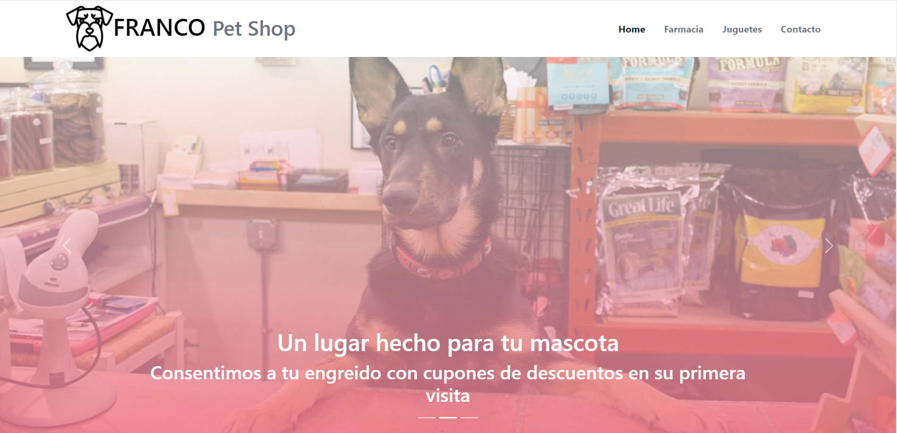
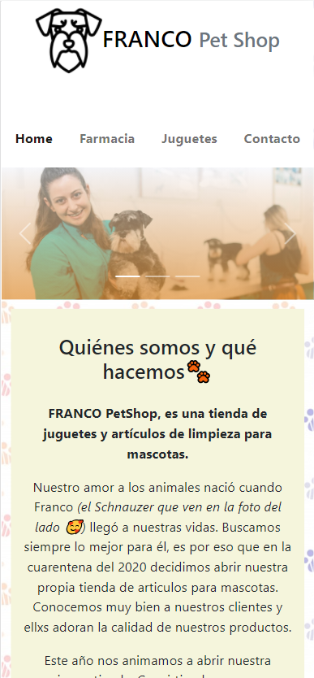

# 🐱 FRANCO Pet Shop 🐶 - Mindhub Bootcamp Front-End Challenge 1

## #️⃣ Índice
1. [Preámbulo](#1️⃣-Preámbulo)
2. [Equipo de Desarrollo](#2️⃣-Equipo-de-Desarrollo)
3. [Resumen del Proyecto](3️⃣-Resumen-del-Proyecto)
4. [Feedback](4️⃣-Feedback)
5. [Agradecimientos](5️⃣-Agradecimientos)

##  1️⃣ Preámbulo

El proyecto FRANCO Pet Shop 🐶 es el primer Challenge del Bootcamp Full Stack Java de Mindhub. 

En este Challenge aplicamos nuestros conocimientos de Front-End Development.

El challenge se realizó desde el 9 de Setiembre al 14 de Setiembre de manera individual. El 14 de Setiembre empezamos el desarrollo en equipo. La iteración final del proyecto fue el 15 de Setiembre del 2021.

## 2️⃣ Equipo de Desarrollo

Equipo de Front-End Development que cumplió este challenge:

Líder del equipo: 🇵🇪 [@IsabelaSanchez](https://github.com/IsabelaSanchez)

* 🇦🇷 [@rdaniel-ctrl](https://github.com/rdaniel-ctrl)
* 🇦🇷 [@EzequielTejeda](https://github.com/EzequielTejeda)
* 🇦🇷 [@francosanna95](https://github.com/francosanna95)
* 🇦🇷 [@MigueMaisares](https://github.com/MigueMaisares)

Todos los miembros del equipo son parte de los cohort FS022 y FS023 de Mindhub.

## 3️⃣ Resumen del Proyecto

FRANCO Pet Shop es un **bold**website responsive trabajado con el framework Vue, HTML, Bootstrap y metodología AGILE SCRUM.**bold**

FRANCO Pet Shop es una tienda de juguetes y artículos de farmacia para mascotas. El cliente desea una tienda online.

Para crear este proyecto recibimos los siguientes requerimientos del cliente:

1. No tengo logo, asi que podés usar como logo una imagen linda que encuentres en la web de algún perro Schnauzer. O si tenés aptitud para el diseño y me querés diseñar algo, adelante. Pero se me ocurre que en el encabezado deberia como minimo haber una imagen de un Schnauzer y el nombre de la tienda.
2. Tendría 4 páginas, la principal donde podrías poner una o dos fotos lindas de perros, gatos, etc. y algún texto que diga “Bienvenidos a mi tienda” y un breve párrafo contando nuestra historia, dónde estamos, etc.
3. Si querés agregar algún mapa de Google Maps buenisimo! Nuestra dirección es Rio de Janeiro 300 (Caballito). Lo que quieras agregar, bienvenido.
4. Después habría una página de “Contáctenos” donde podrías poner un formulario para que el cliente ingrese nombre y apellido, teléfono, que indique si tiene perro y/o gato y una casilla para comentarios. Y que el botón de envío del formulario solo haga que aparezca un cartelito que diga que se envió y muchas gracias por escribirnos, o algo así, por ahora no hagas nada con el formulario. Si se te ocurre algún otro campo además de los que te puse (nombre, mascota, etc) agregalo!
5. Después habría otros dos páginas, una “Farmacia” y otra “Juguetes” ahí tenés que poner algunas fotos ilustrativas (de farmacia o de juguetes) y en cada una tenés que mostrar artículos. Para esto tenés que hacer un pedido a una API que te va a devolver un JSON con aproximadamente 15 artículos, algunos juguetes y otros medicamentos. Los medicamentos los tenes que mostrar en la página que corresponde y los juguetes en la otra. Hacele un cuadradito donde esté la imagen (te viene en ese JSON la dirección de la imagen), el nombre del artículo, el precio, hacemelo bonito!!! :) Como si fuera un MercadoLibre, viste? Asi, como una grilla con articulos, colores, linda letra, esmerate!
6. Y te pido algo: tendrias que lograr que en aquellos articulos (medicamentos o juguetes) que tienen menos de 5 (cinco) unidades de stock aparezca un cartel rojo que diga “Ultimas unidades!!!” asi fomentamos la venta!! 

Se utilizó la API:https://apipetshop.herokuapp.com/api/articulos

### MVP
Vista Web del producto:

Vista Mobile del producto:

## 4️⃣ Feedback

Se realizó feedback de mentores y egresados de Mindhub después de la exposición de la iteración final.

* Eliminar el mensaje últimas unidades cuando se agotá el stock de un producto
* Cambiar el background-color de las tarjetas de productos por el background linear-gradiente de título de farmacia y juguetes.
* Utilizar el local-storage en el carrito de compras.

## 5️⃣ Agradecimientos

Gracias totales a...
* Profe Branko
* Silvi
* Muchas tazas de café y mate
* A los cohort FS022 y FS023 de Mindhub
* En caso de Isabela, a Chicas en Tecnología, por presentarme a Mindhub y darme la oportunidad de seguir aprendiendo.

